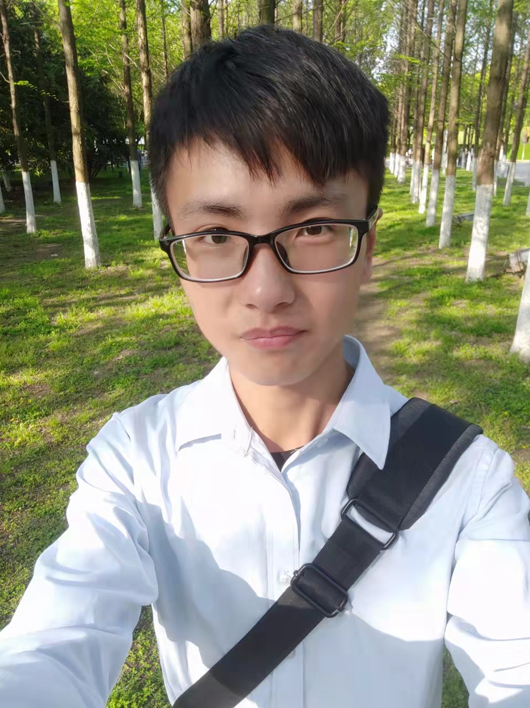

# Welcome to Kun's Org

Hi,I'm  Xingkun Zhang.

I am from Wuhan Institute of Technology.

This is me in 2020.

I haven't taken a selfie in a long time, so I don't have a recent photo.

I like to use code to implement some of my ideas.

In addition to my software hobbies, I also enjoy working on hardware. Such as STM32. 

I tried to learn a lot in college. 

I think it's hard to master one thing, but if you just want to get above the pass line, anyone can do it if you work hard.

